# Интерфейс BEAM Control Panel

Все снимки сделаны с реально работающего экземпляра панели (демо-данные из
`priv/repo/demo_seeds.exs`): четыре сервера, четыре BEAM-проекта, история
деплоев и аудита. Разрешение 3000×2000 (2× retina), светлая тема.

Воспроизвести у себя:

```bash
mix ecto.reset
mix run priv/repo/demo_seeds.exs
mix phx.server          # вход: admin@example.com / demo-password-1234
```

---

## 1. Вход

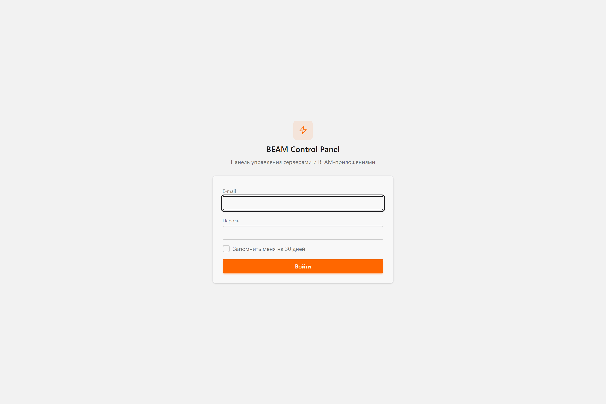

Единственная страница, доступная без авторизации. Поля e-mail и пароль,
галочка «Запомнить меня на 30 дней». Если у пользователя включена
двухфакторная аутентификация, после верного пароля форма перерисовывается и
добавляет поле для одноразового кода — пароль без кода сессию не создаёт.

Пять неудачных попыток подряд увеличивают счётчик, десять — блокируют учётную
запись на 15 минут. Каждая неудача пишется в аудит с IP.

На чистой установке этой страницы ещё нет: пока в системе нет ни одного
пользователя, любой запрос перебрасывает на мастер `/setup`, где создаётся
первый администратор.

---

## 2. Обзор

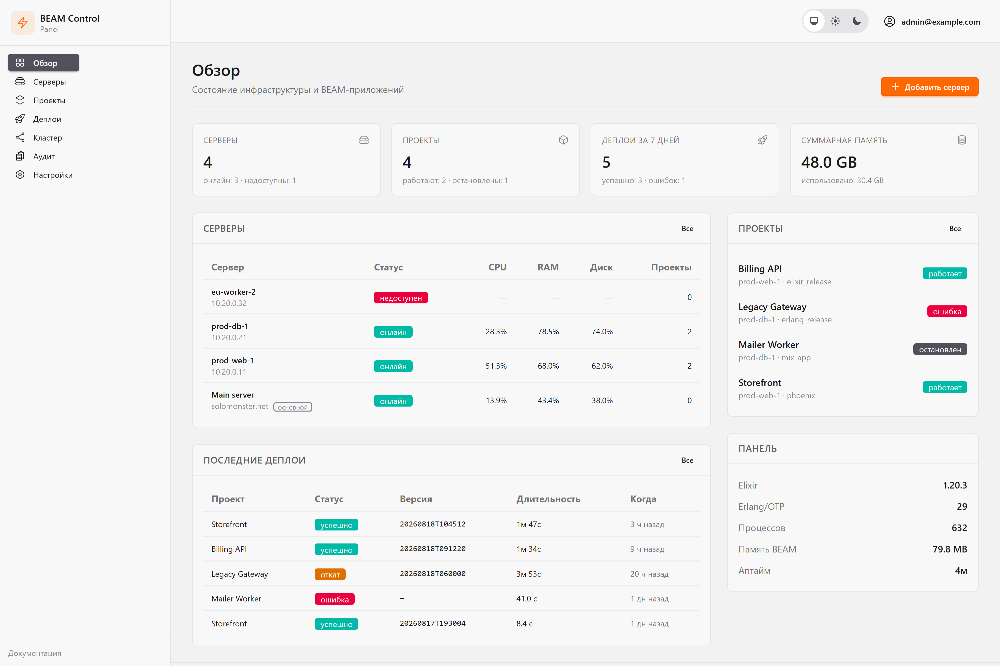

Стартовая страница. Сверху четыре плитки: количество серверов с разбивкой по
доступности, количество проектов с разбивкой по состоянию, число деплоев за
семь дней и суммарная память всего парка.

Таблица **Серверы** обновляется вживую через LiveView: значения CPU, RAM и
диска приходят по PubSub от коллекторов и меняются без перезагрузки страницы.
Недоступные узлы помечены красным бейджем — в примере это `eu-worker-2`.

Справа список проектов с их состоянием и карточка **Панель** с параметрами
самой панели: версии Elixir и Erlang/OTP, число процессов в её BEAM, занятая
память, аптайм. Это полезно, когда нужно понять, жива ли панель сама.

Внизу — последние деплои со статусом, версией релиза, длительностью и временем.

---

## 3. Серверы

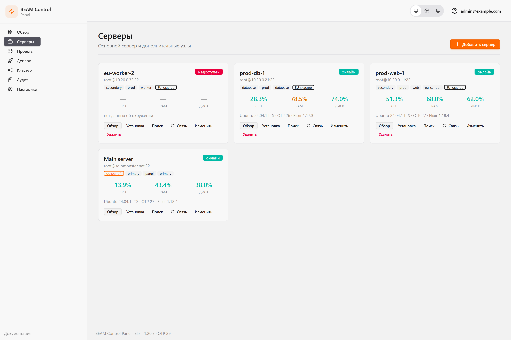

Карточка на каждый узел. В карточке: имя и адрес подключения, бейдж состояния,
теги и роль, три показателя загрузки (CPU / RAM / диск) с цветовой индикацией
(зелёный до 75 %, жёлтый до 90 %, красный выше), строка окружения с версиями
ОС, OTP и Elixir.

Кнопки под карточкой ведут к обзору сервера, установке ПО, поиску проектов,
проверке связи и редактированию. Основной сервер помечен бейджем «основной» и
удалить его нельзя.

Кнопка «Добавить сервер» открывает модальное окно: имя, хост, порт, пользователь,
способ аутентификации (приватный ключ, пароль или SSH-агент), поле для самого
ключа, пароль sudo, каталог деплоя, группа, интервал опроса и теги.

---

## 4. Обзор сервера

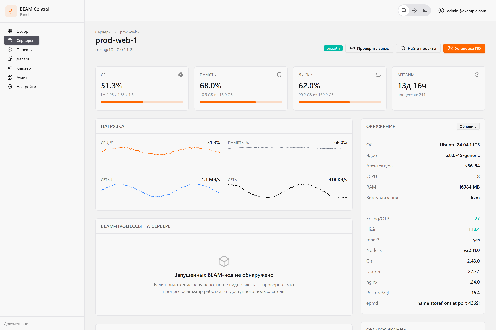

Всё о конкретном узле. Четыре плитки с прогресс-барами, ниже блок **Нагрузка**
с четырьмя спарклайнами за последние 15 минут: CPU, память, входящий и
исходящий трафик. Графики — inline-SVG, рисуются на сервере, без единой
внешней библиотеки.

Справа **Окружение**: дистрибутив, ядро, архитектура, число ядер, объём
памяти, тип виртуализации, а ниже — версии всего, что важно для BEAM. Erlang и
Elixir подсвечены зелёным, если установлены, и красным, если нет: это первое,
на что смотришь перед деплоем.

Блок **BEAM-процессы на сервере** показывает найденные `beam.smp` с именем
ноды, потреблением памяти и аптаймом — даже для приложений, которые панель ещё
не знает как проекты.

Ниже (не поместилось на снимок) — список проектов сервера, топ процессов по CPU
с возможностью послать сигнал, блок обслуживания с проверкой обновлений системы,
переходом к управлению службами и перезагрузкой сервера.

### Недоступный сервер

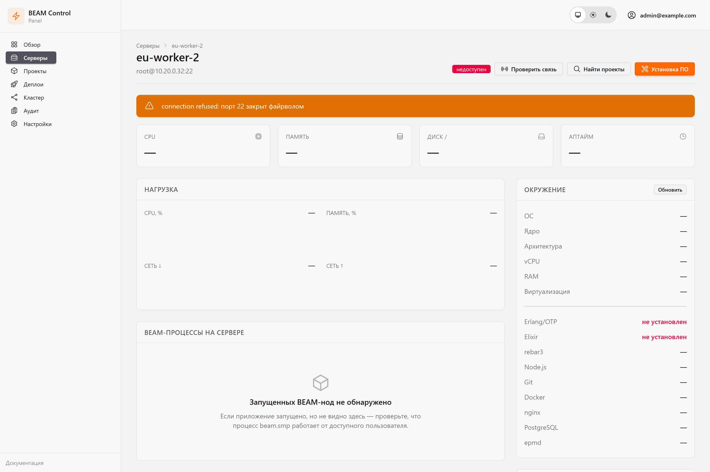

Так выглядит узел, до которого панель не достучалась. Причина показана дословно —
здесь `connection refused: порт 22 закрыт файрволом`. Метрики заменены прочерками,
блок окружения пуст, Erlang и Elixir отмечены как «не установлен», потому что
данных просто нет. Коллектор при этом продолжает попытки с нарастающим
интервалом, до пяти минут между проверками.

---

## 5. Установка ПО (провижининг)

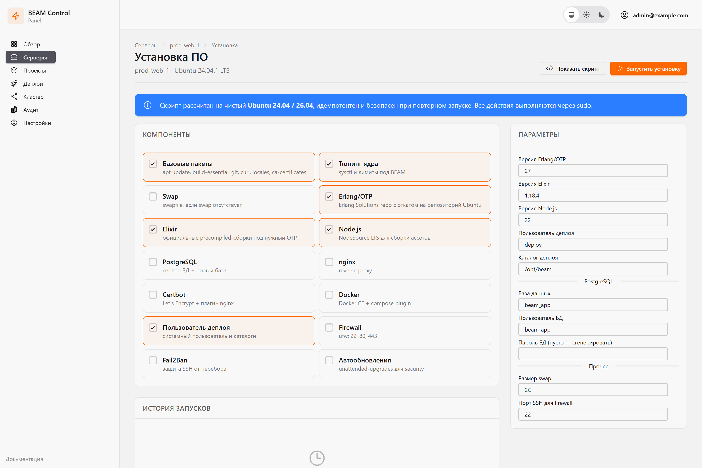

Подготовка чистого Ubuntu 24.04 / 26.04 к работе с BEAM. Слева четырнадцать
компонентов с описаниями: базовые пакеты, тюнинг ядра, swap, Erlang/OTP, Elixir,
Node.js, PostgreSQL, nginx, certbot, Docker, пользователь деплоя, firewall,
Fail2Ban, автообновления. Отмеченные по умолчанию подсвечены рамкой.

Справа параметры: версии Erlang, Elixir и Node, пользователь и каталог деплоя,
имя базы, пользователь и пароль PostgreSQL, размер swap, порт SSH для правил
firewall.

Кнопка «Показать скрипт» открывает **ровно тот bash**, который будет выполнен —
никакой скрытой магии, скрипт можно прочитать, скопировать и запустить руками.
Он идемпотентен: повторный запуск ничего не ломает.

«Запустить установку» выполняет скрипт по SSH и переводит на страницу с живым
журналом. Ниже на странице — история прошлых запусков.

---

## 6. Проекты

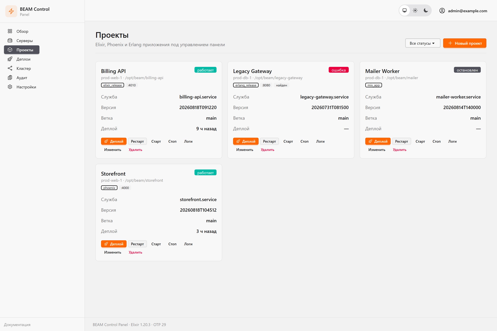

BEAM-приложения со всех серверов. В карточке: название, сервер и каталог,
состояние службы, тип (`phoenix`, `elixir_release`, `mix_app`, `erlang_release`),
порт, отметка «найден» для автоматически обнаруженных приложений, имя
systemd-юнита, текущая версия, ветка и время последнего деплоя.

Кнопки: деплой, рестарт, старт, стоп, логи, редактирование, удаление из панели.
Фильтр в шапке отбирает проекты по состоянию.

Форма создания проекта запрашивает сервер, тип, `MIX_ENV`, порт, Git-репозиторий
и ветку, каталог деплоя, имя релиза и systemd-юнита, имя ноды и cookie, URL
health-check и команду миграций. Всё, что не задано, выводится из имени проекта.

---

## 7. Обзор проекта

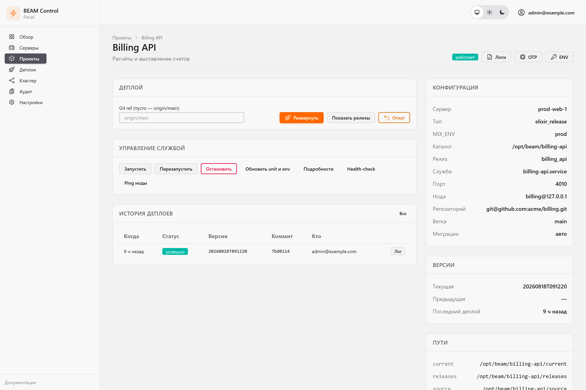

Блок **Деплой**: поле для git-ref (пусто — берётся `origin/<ветка>`), кнопка
запуска, показ доступных релизов на сервере и откат. Откатиться можно как на
предыдущий релиз одной кнопкой, так и на любой конкретный из списка.

Блок **Управление службой**: старт, рестарт, стоп, обновление systemd-юнита и
env-файла, подробности юнита, health-check и ping ноды. Результаты выводятся
тут же.

Справа — конфигурация проекта, текущая и предыдущая версии, а также вычисленные
пути: `current`, `releases`, `source` и путь к управляющему скрипту релиза.
Полезно, когда нужно зайти на сервер руками.

Внизу — история деплоев проекта со ссылками на журналы.

---

## 8. Переменные окружения

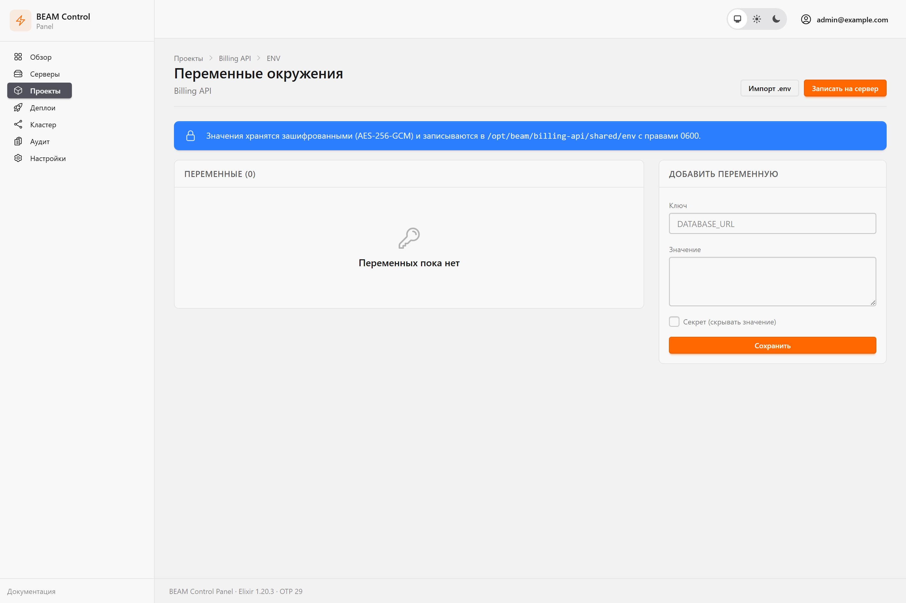

Значения хранятся в базе зашифрованными (AES-256-GCM) и выгружаются в
`<каталог>/shared/env` с правами 0600. Переменные, помеченные как секретные,
показаны точками — открыть значение можно кнопкой с глазом.

Есть массовый импорт в формате `.env`: панель сама распознаёт секреты по
названию ключа (`SECRET`, `PASSWORD`, `TOKEN`, `KEY`, `DSN`, `CREDENTIAL`) и
помечает их.

Кнопка «Записать на сервер» переносит файл на узел без перезапуска приложения —
перезапуск остаётся решением оператора.

---

## 9. Деплои

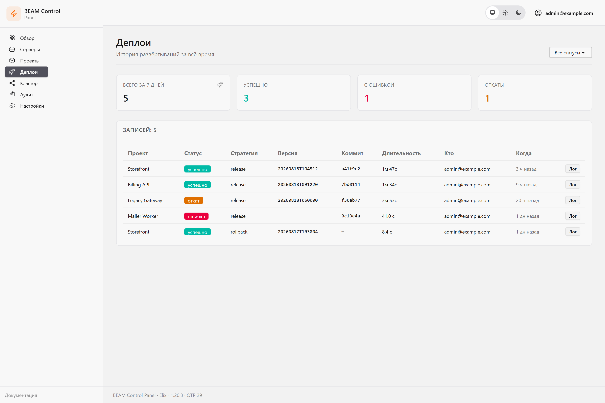

Сквозная история по всем проектам. Сверху сводка за неделю: всего, успешно,
с ошибкой, откаты. Таблица показывает проект, статус, стратегию (`release`,
`rollback`, `restart`), версию, короткий хеш коммита, длительность, инициатора
и время. Фильтр по статусу — в шапке.

---

## 10. Журнал деплоя

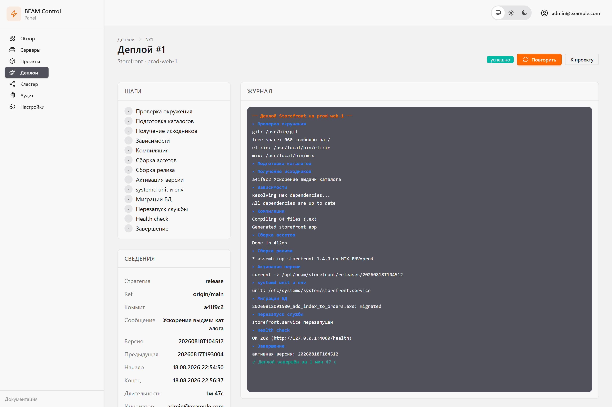

Главная страница во время выкатки. Слева — одиннадцать шагов пайплайна;
выполненные отмечены галочкой, текущий пульсирует, упавший — крестиком.
Справа — журнал, который пишется в реальном времени: каждая строка вывода с
сервера приходит по PubSub и сразу появляется на экране, консоль сама
прокручивается вниз, пока оператор не проскроллит вверх.

Строки подсвечены по смыслу: шаги, успех, ошибки, откат. Ниже — сведения о
деплое: ref, коммит и его сообщение, версии, время начала и конца, длительность,
кто запустил.

Незавершённый деплой можно прервать, завершённый — повторить одной кнопкой.
Если приложение не прошло health-check, панель сама возвращает предыдущий релиз
и помечает деплой как «откат».

---

## 11. Кластер

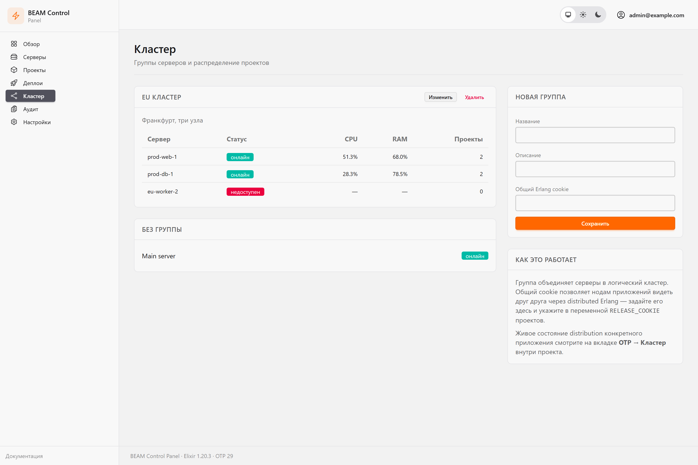

Группы серверов как логические кластеры. По каждой группе — таблица узлов с
состоянием, загрузкой и числом проектов. Серверы без группы вынесены отдельно.

Справа форма группы с общим Erlang cookie: его же нужно указать проектам в
`RELEASE_COOKIE`, чтобы ноды видели друг друга. Живое состояние distribution
конкретного приложения смотрится на вкладке **OTP → Кластер** внутри проекта.

---

## 12. Аудит

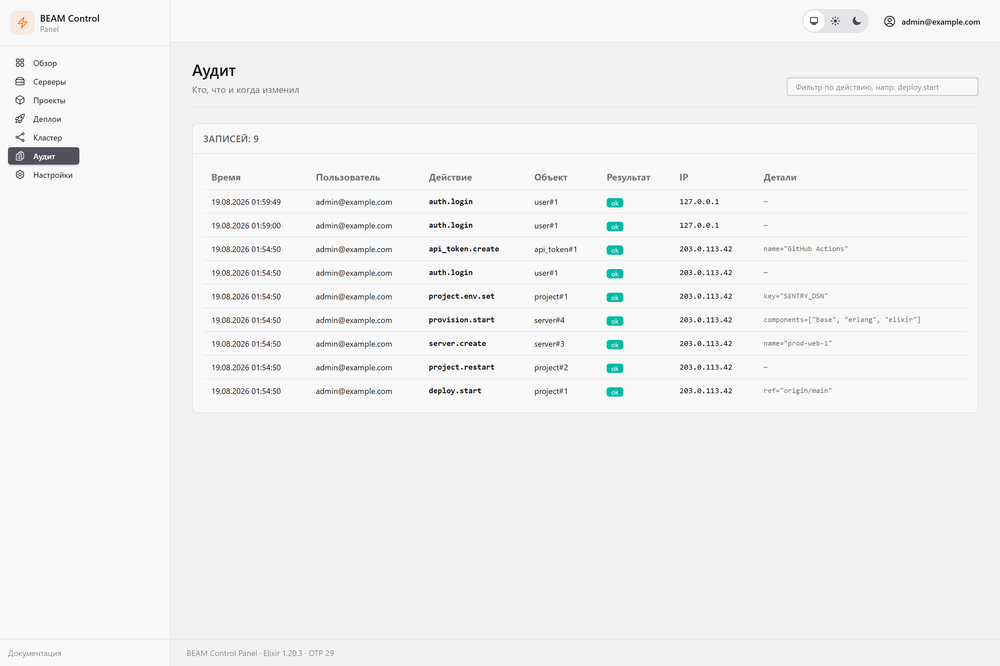

Все изменяющие действия: кто, что, над каким объектом, с какого IP и с каким
результатом. Пишется автоматически из контекстов, а не из контроллеров, поэтому
запись появляется и при действии через REST API. Фильтр по имени действия
(`deploy.start`, `project.restart`, `provision.start`, `auth.failed` и так далее).

Записи не редактируются и не удаляются из интерфейса.

---

## 13. Профиль и двухфакторная аутентификация

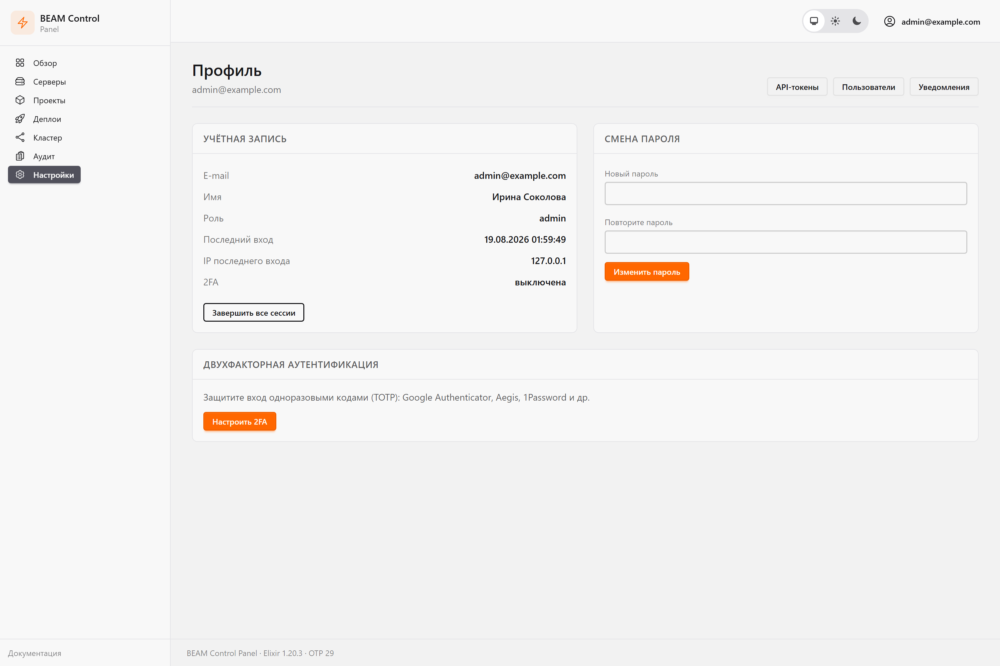

Сведения об учётной записи, время и IP последнего входа, смена пароля (после
смены все остальные сессии завершаются), кнопка принудительного выхода со всех
устройств.

Блок 2FA: панель генерирует секрет, показывает его в Base32 и в виде
`otpauth`-ссылки для добавления в Google Authenticator, Aegis, 1Password и
подобные. Включение подтверждается одноразовым кодом — без верного кода
настройка не сохраняется.

---

## 14. Пользователи

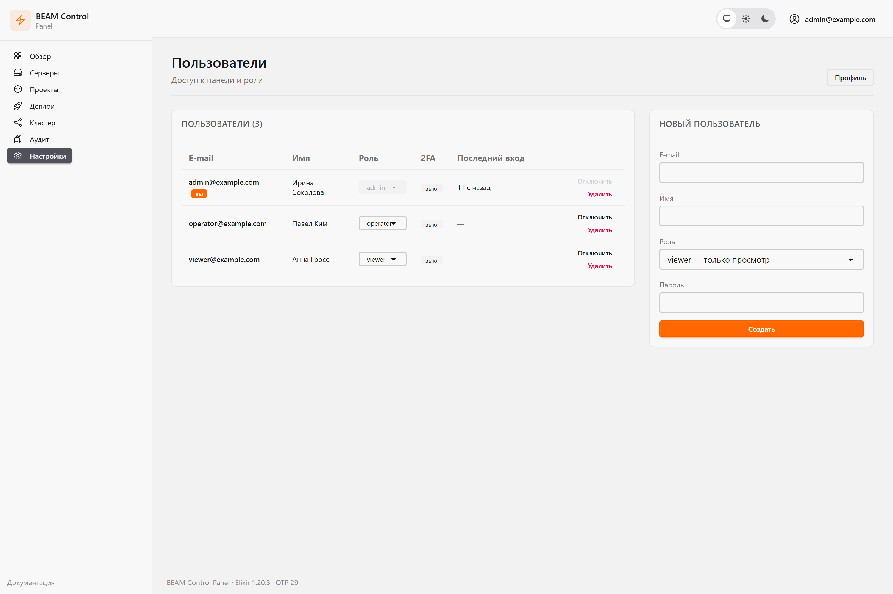

Доступно только администраторам. Список с ролью, состоянием 2FA и временем
последнего входа. Роль меняется прямо в таблице.

Три роли: `viewer` — только чтение, `operator` — деплой, рестарт и провижининг,
`admin` — всё, включая управление пользователями и удалённую консоль на нодах.

Панель не даёт выстрелить себе в ногу: нельзя изменить собственную роль,
отключить или удалить самого себя, а также удалить последнего администратора.

---

## 15. Уведомления

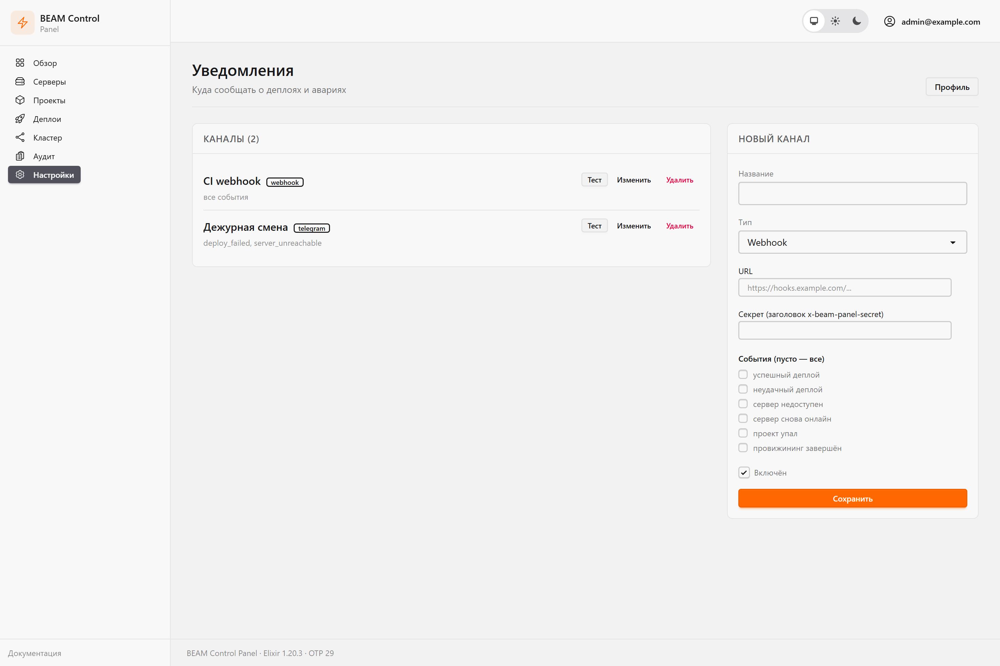

Каналы доставки: webhook, Telegram, Slack, Discord и e-mail. У каждого канала
свой набор полей (для Telegram — токен бота и chat_id, для остальных — URL) и
список событий: успешный и неудачный деплой, сервер стал недоступен, сервер
вернулся, приложение упало, провижининг завершён. Пустой список означает «все
события».

Конфигурация канала шифруется в базе. Кнопка «Тест» отправляет пробное
сообщение и показывает ошибку доставки, если она есть; последняя ошибка и время
последней успешной отправки видны в списке.

---

## 16. API-токены

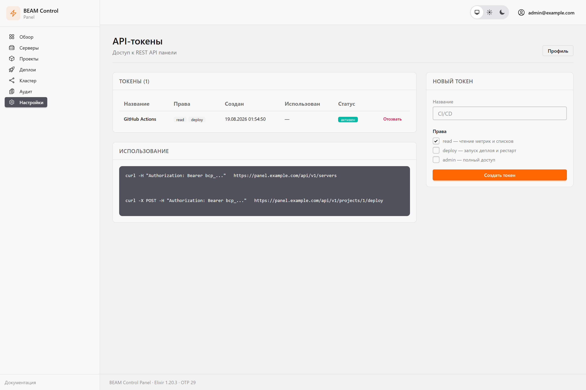

Токены для REST API с областями действия: `read` — чтение метрик и списков,
`deploy` — запуск деплоя, рестарт и откат, `admin` — полный доступ.

В базе хранится только SHA-256 хеш; сам токен показывается один раз при
создании. Видно время создания, время последнего использования и состояние.
Отозванный токен перестаёт работать немедленно.

Ниже — пример вызова API с этим токеном.

---

## Экраны без снимков

Три страницы требуют живого удалённого узла, поэтому в демо-данных их показать
нечем:

* **Проект → Логи** — потоковый `journalctl -u <юнит> -f` с фильтром, паузой
  и очисткой. Строки приходят через SSH-канал и раздаются в LiveView.
* **Проект → OTP** — восемь вкладок интроспекции запущенной ноды: обзор
  (планировщики, память по типам, процессы, атомы, ETS, порты), список
  приложений, дерево супервизоров, топ процессов, ETS-таблицы, порты,
  distribution и удалённая консоль. Данные снимаются через
  `bin/<релиз> rpc` и приходят структурой, а не текстом.
* **Сервер → Поиск проектов** — автообнаружение приложений по systemd-юнитам,
  каталогам с `mix.exs` / `rebar.config` и запущенным процессам `beam.smp`;
  найденное добавляется в панель одной кнопкой.

---

## Тёмная тема

Переключатель в правом верхнем углу: системная тема, светлая, тёмная. Выбор
сохраняется в браузере и применяется до первой отрисовки, поэтому вспышки
светлого фона на тёмной теме нет.
